# AISecMatrix

1. [Abstract](#abstract)

2. [Environment Access](#environment-access) 

* 2.1 [Dependent Software Attack](#dependent-software-attack)
* 2.2 [Malicious Access to Docker](#malicious-access-to-docker)
* 2.3 [Hardware Backdoor Attack](#hardware-backdoor-attack)
* 2.4 [Supply Chains Attack](#supply-chains-attack)

3. [Data Collection](#data-collection) 

* 3.1 [Data Poisoning](#data-poisoning)
* 3.2 [Data Backdoor Attack](#data-backdoor-attack)

4. [Model Training](#model-training) 

* 4.1 [Data Recovery in Gradient](#data-recovery-in-gradient)
* 4.2 [Initial Weight Modification](#initial-weight-modification)
* 4.3 [Code Attack](#code-attack)
* 4.4 [Training Backdoor Attack](#training-backdoor-attack)
* 4.5 [Non-centralized Scenarios](#non-centralized-scenarios)

5. [Model Deployment](#model-deployment) 

* 5.1 [Data Recovery in the Model](#data-recovery-in-the-model)
* 5.2 [Model File Attack](#model-file-attack)

6. [Model Usage](#Model-Usage) 

- 6.1 [Digital Adversarial Attacks](#Digital-Adversarial-Attacks)
- 6.2 [Physical Counter Attack](#Physical-Counter-Attack)
- 6.3 [Model Stealing](#Model-Stealing)
- 6.4 [GPU/CPU overflow destruction](#GPU/CPU-overflow-destruction)

7. [Model Architecture](#Model-Architecture) 

- 7.1 [Query Architecture Stealing](#Query-Architecture-Stealing)
- 7.2 [Side Channel Architecture Stealing](#Side-Channel-Architecture-Stealing)

8. [Effect of results](#Effect-of-results)

- 8.1 [Model Misjudgment](#Model-Misjudgment)
- 8.2 [Information Leakage](#Information-Leakage)

  

[Reference](#reference)

[Go To End](#end)

----

This is the github repository for ongoing project --- AISecMatrix （AI安全威胁矩阵）.

    

## 1. Abstract

In the past few years, AI techniques have gained wide application in a number of fields, including Image Processing, Speech Recognition, Natural Language Processing, etc. Hence, in security critical application senarios, the security issues of AI techniques have increasingly become the focus of research community and industrial corporations. Besides their performance, engineers and users should also take the security problems of the AI systems into account, and ensure the satefy of AI models in different business scenarios, avoiding serious consequences induced by malicious control, influence, fraud, faults and privacy disclosure.

To provide developers and users a better guidance on the security issues of AI systems, this report aims to release a framework **([Figure. 1](#figure-1))** to illusrate the attack process and specific attack techniques from the adversaries' perspectives, based on ATT&CK paradigm, which is already relatively mature in the network security domain.  Understanding and identifying these techniques is helpful for AI developers and maintainers to realize potential risk of AI systems during the overall life cycle and the corresponding solutions, providing essential technical guarantee for the application and deployment of AI systems.

***<u>Figure-1</u>***

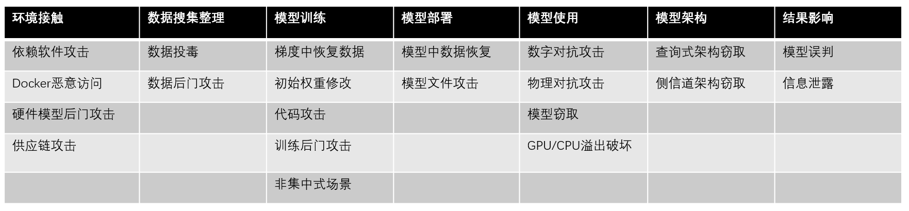

    

## 2. Environment Access

 

 

### 2.1 Dependent Software Attack

Machine Learning systems depend on the support from various bottom software frameworks and libraries. Security vulnerabilities hidden in these dependent softwares may pose serious threats to the integral safety of AI systems. Currently, there are various Deep Learning frameworks available, e.g. TensorFlow, Pytorch, etc. These software frameworks will further interact with hundreds of third-party dynamic libraries, including Numpy, OpenCV, etc. Security problems in these components will also severely threaten those systems based on Deep Learning framework. So far, a number of security bugs in dependent libraries of Deep Learning framework have already been reported, including Memory Overflow, Null Pointer Reference, Integer Overflow, Denial-of-Service Attack, etc. **[[1](#ref-1),[2](#ref-2)]** For instance, in the past few years, in OpenCV library, which is one of the most widely used libraries in Deep Learning programs, several security bugs were discovered (especially the CVE-2019-5063 and CVE-2019-5064 reported at the end of 2019, which are quite severe). Based on these bugs, attackers can directly use traditional attack techniques **[[3](#ref-3),[4](#ref-4)]** to bring about the threats of Arbitrary Code Execution to the application of AI systems. Besides, as shown in **[Figure. 2](#figure-2)**, these dependent libraries also have other types of bugs, potentially inducing Denial-of-Service Attack, Heap Overflow, Integer Overflow, etc., which will also pose severe threats to the safety of the systems.

Meanwhile,  attackers can also inject malicious codes into the model files used by Deep Learning frameworks (e.g. Tensorflow, Pytorch) **[[6](#ref-6)]**, which makes the common usage of third-party pretrained models also a risky behavior. These cases give us the caution that --- with the security research going deeper, users and developers should be more safety conscious, to defend against continuously emerging attack techniques.

**<u>Tips for defense:</u>** seasonably check and update the reported security bugs in dependent softwares and libraries, avoding damage to AI systems induced by bugs exploitation.

***<u>Figure-2</u>***

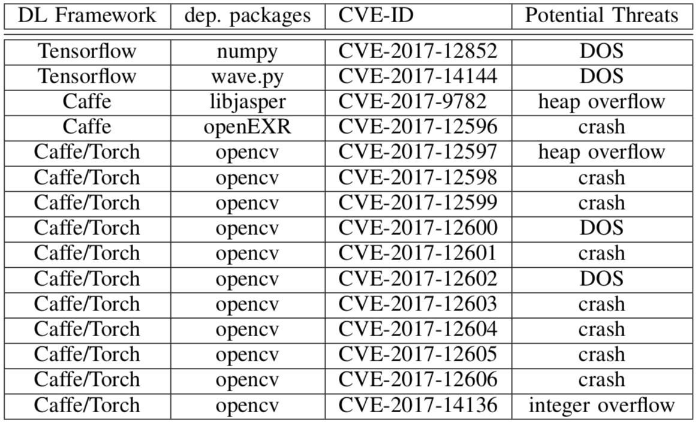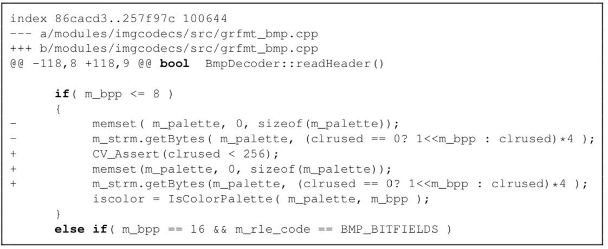

 

 

### 2.2 Malicious Access to Docker

Machine Learning tasks can be deployed in Kubernetes clusters via KubeFlow framework **[[5](#ref-5)]**. Since usually the computation nodes for ML tasks have strong calculation capability, these nodes are thus becoming ideal attack targets for adversaries. For instance, attackers may hijack these ML tasks nodes and exploit them for mining. **[[6](#ref-6)]** One example is, in June 2020, Azure Security Center at Microsoft issued one warning after they detected malicious mining programs installed in Kuberflow by attackers. This security program was induced by improper configurations --- some users modified the default settings for panel access, changing Istio service into Load-Balancer, for convinient access. Such improper configurations made the service public for Internet, so that attackers could access the panel and deploy backdoor containers in the clusters via various methods. For example, with space search engines such as Shodan, Fofa, etc., adversaries can discover Kubernets exposed in public network and thus gaining opportunities to execute malicious codes **[[5](#ref-5)]**. As shown in **[Figure. 3](#figure-3)**, adversaries can complete the attacks by loading customized malicious Jupyter images, during the creation of Juputer application services in Kubeflow. Meanwhile, attackers can also directly deploy malicious containers via inserting additional python codes in Jupyter, which may further enlarge the attackers' accessibility to critical data/codes and even harm the integral security of the ML models.

**<u>Tips for defense:</u>** Developers and maintainers should be familiar with containers' common application scenarios and corresponding defensive techniques. As for relevent techniques, we refer interested readers to the Kubernetes threatening models **[[8](#ref-8)]** released by Microsoft. 

***<u>Figure-3</u>***

 

 

 

### 2.3 Hardware Backdoor Attack

Hardware Backdoors Attacks (also known as Hardware Trojans Attacks) can take place during the trained models being deployed in hardware devices, where adversaries may insert backdoors into the deployed models by making very slight modificaiton to hardware components, e.g. Lookup Table. Those models that contain backdoors can still operate normally on common cases, however, malicious behaviors could be triggered in certain preseted senarios, resulting in stealthy and severe theats.

Mordern integrated circuits usually contain third-party IP cores, which are commonly adopted as integrated modules for swift deployment. Such commonly used and modularized mechanisms enable hardware attackers to design Trojans for certain IP cores and thus correspondinly affecting a substantial number of hardware devices which use these modules. For instance, as illusrated in **[[9](#ref-9)]**, one can bring a neural network model to always making incorrect predictions by only modifying 0.03% of the model's parameteres during hardware deployment stage. **[[10](#ref-10)]** further showed that, by merely flipping 13 bits of a model with 93M bits, a ImageNet classifier with 70% accuracy could be reduced to a random classifier. Recently, **[[11](#ref-11)]** proposed Sequence Triggered Hardware Trojan for neural networks, which can totally invalidate a classifier, once a certain sequence of normal images are input into the model, as shown in **[Figure. 4](#figure-4)**.

So far, Hardware Backdoor Attack is still a newly emerging research area, and existing research study on this area is limited. However, in real application scenarios, this type of attack poses a severe threat. For example, attackers can inject backdoors into vision system of an autonomous driving car in the form of hardware Trojans, and the life safety of passengers may be seriously threatened if the backdoors are triggered. Note that, existing backdoors injection usually can only be  implemented by the models' owners. It would be very valuable to study the backdoors injection from outside invaders, since it's a more risky attack scenarios.

***<u>Figure-4</u>***

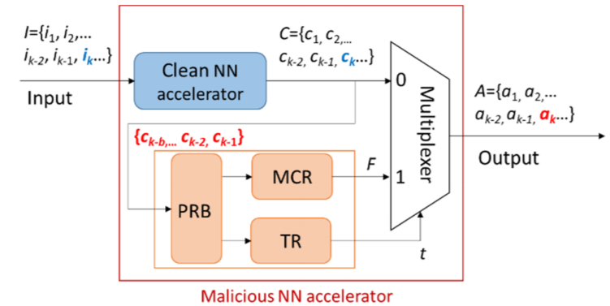

 

 

### 2.4 Supply Chains Attack

As shown in **[Figure. 5](#figure-5)**, attackers can perform Supply Chains Attack in multiple ways, e.g. exploiting open source platform to release malicious pretrained models, constructing backdoors by controlling or modifying software and hardware platforms.

For instance, attackers can inject malicious instructions into model files by exploiting the security bugs Numpy CVE-2019-6446. Researchers already found that, when model loading functions like "torch.load" are executed, this security bug can be triggered, resulting in execution of malicious instructions. Since the execution of these malicious instructions will not affect the common usage of the models, such attacks are very stealthy. As shown in **[Figure. 6](#figure-6)**, using this bug, attackers can inject instructions into the model file (e.g. binary model file saved by Pytorch), and the "Calculator" program is launched when the model file is loaded. Similarly, attackers can also download and execute Trojan instructions in this way **[[12](#ref-12)]**, which makes this type of attacks very threatening.

**<u>Tips for defense:</u>** Make sure the srouce of model files are trustworthy before loading them, and be cautious in third-party model files.

***<u>Figure-5</u>***

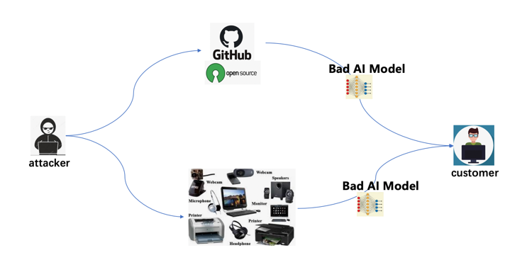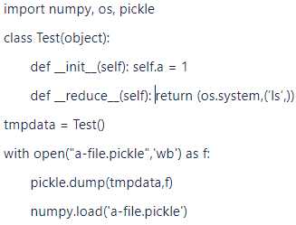

***<u>Figure-6</u>***

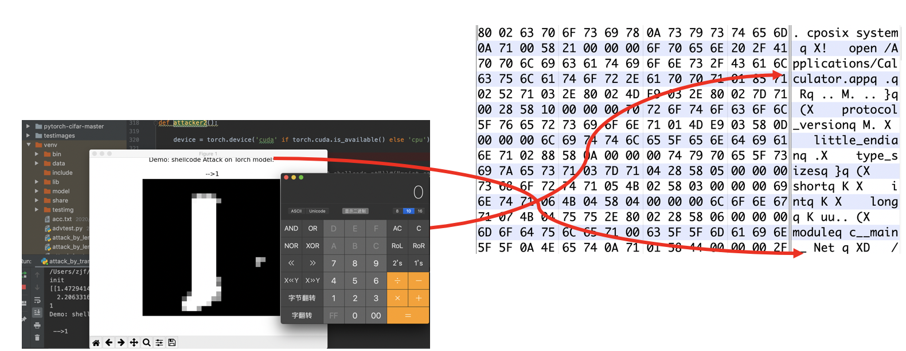

  

  

## 3. Data collection

### 3.1 Data Poisoning

***<u>Figure-7: From left to right are the images of target test that hope to be divided into the wrong ones, the poisoned training sample 1, the poisoned training sample 2 **[[13](#ref-13)]**.</u>***

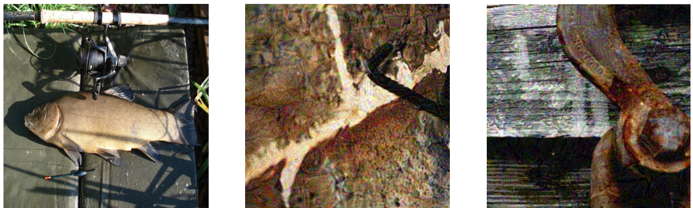

 

Data poisoning refers to the attack of malicious manipulation model by polluting part of training data before training. Generally speaking, poisoning attacks can be divided into two categories: the first type of poisoning attacks hopes that the network will perform well in normal tests, but it makes a wrong judgment on specific images; the second type of poisoning attacks hopes that the network performs poorly in the test set, and even the training is difficult to converge.

 

The first type of poisoning can be divided into clean sample poisoning and wrong sample poisoning. The pollution data released by the former is normal sample in human eyes, so it is hidden and difficult to be detected by the trainer; the latter type of poisoning method uses the wrong labeled data. Its success rate is generally relatively high, but its concealment is insufficient. If the attacker can obtain the model parameters of the target to be attacked, it may only need to introduce a piece of poisoned data to make the model judge the specific image incorrectly. Even if the attacker does not know the specific parameters of the model, the attacker can achieve a 50% success rate of poisoning by using multi model integration to produce pollution data with only 1% poisoning ratio **[[13](#ref-13)]**. As shown in **[Figure. 7](#figure-7)**, modifying several different pictures in the training set for poisoning can make the trained model recognize the specific target graph which is different from the training picture as the category designated by the attacker **[[13](#ref-13)]**.

 

The second type of poisoning aims to reduce the overall performance of the model **[[15](#ref-15)]**, which mainly targets at traditional machine learning models such as SVM **[[16](#ref-16)]**, logical regression **[[17](#ref-17)]**. Of course, the second type of poisoning for deep learning can also have a higher success rate **[[18](#ref-18)]**.

 

At present, the poison attack to the white box model has been relatively complete, but how to better poison the black box model is still a problem worth studying. How to reduce the proportion of poisoning samples and improve the success rate and stability of black box poisoning is an important research direction in the future.

 

**<u>Defense suggestions:</u>** Be alert to the data from unknown sources; Use the algorithm **[[19](#ref-19),[20](#ref-20)]** to detect abnormal samples before training; Preprocess the used data by using yje data augmentation; Try to avoid transfer learning based on completely open model, so as to improve the difficulty of poisoning attack.

 

### 3.2 Data Backdoor Attack

Backdoor Attack is an emerging attack method against machine learning models. An attacker may bury a back door into the model, which may lead to the infected model behaving normally in general. However, when the back door is activated, the output of the model becomes the malicious target set by the attacker. When the training process of the model is not completely controlled, for example, scenarios such as training/pre-training using third-party training data sets, training using third-party computing platforms, modeling provided by the third party, etc., backdoor attacks may occur. Because the model behaves normally until the back door is triggered, this kind of malicious attack behavior is difficult to be detected.

 

***<u>Figure-8: Schematic diagram of backdoor attack based on data poisoning **[[21](#ref-21)]**.</u>***

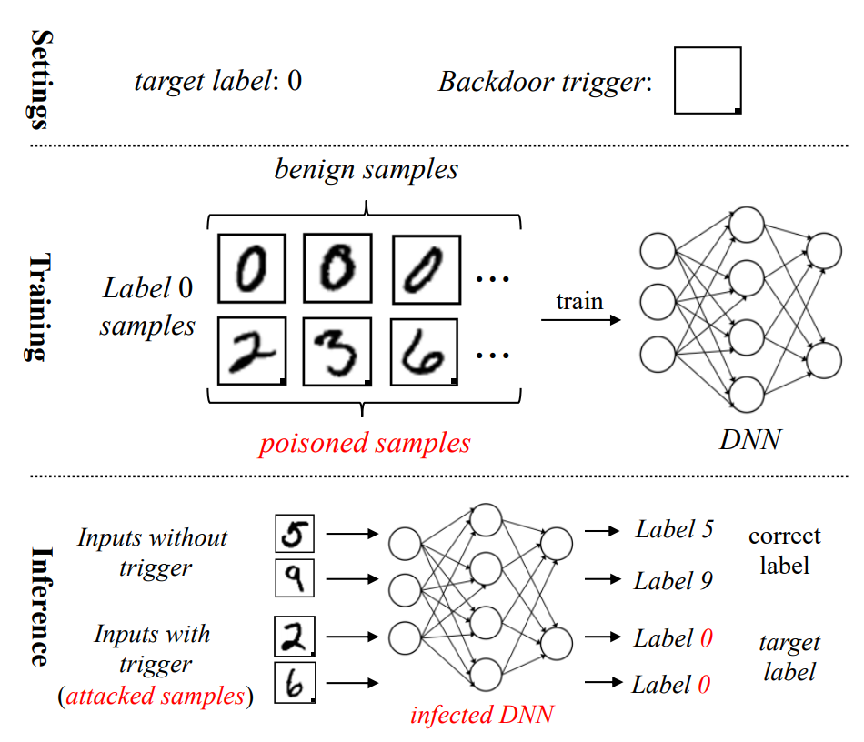

 

Data backdoor attack refers to backdoor implantation through poisoning training data set **[[22](#ref-22),[23](#ref-23),[24](#ref-24)]**. As shown in **[Figure. 8](#figure-8)**, in the image classification task, some training images will be "tagged" with specific triggers, and then their labels will be converted into target labels specified by attackers. These poisoned samples and benign samples will be used for model training together. Therefore, during the test phase, the normal test samples will be predicted as their corresponding categories by the model, but the test samples containing triggers  (being attacked) will activate the hidden backdoors in the model and make them be divided into target categories.

 

At present, the trigger of a backdoor attack can reach an invisible level of human eyes **[[23](#ref-23),[24](#ref-24),[25](#ref-25)]**, and the real label of the poisoned sample can even be completely consistent with the target label **[[23](#ref-23),[24](#ref-24)]**, which makes the backdoor attack more difficult to detect. Besides, in addition to image classification task, backdoor attack has also been proved to have significant attack effect in other different task scenarios **[[26](#ref-26),[27](#ref-27),[28](#ref-28)]**. Therefore, backdoor attack poses a great threat to the security of deep learning model.

 

**<u>Defense suggestions:</u>** for backdoor attacks, there are also some corresponding defense methods proposed. The existing backdoor defense methods can be divided into empirical backdoor defense methods and certified backdoor defense methods. The empirical backdoor defense method generally has good performance, but its effectiveness is not guaranteed theoretically; On the other hand, the validity of the authenticated backdoor defense method is guaranteed theoretically under certain assumptions, but its performance is generally weaker than that of the empirical back door defense method in real scenarios. The existing authenticated backdoor defense methods **[[29](#ref-29),[30](#ref-30)]** are mainly based on Random Smoothing technology, while empirical backdoor defense methods have many different ways, which can be divided into the following six basic categories **[[21](#ref-21)]**:
* Defense based on preprocessing **[[31](#ref-31),[32](#ref-32),[33](#ref-33)]**: Preprocess the prediction samples before the prediction begins, and then destroy the triggers that may exist in the samples, so that the backdoor cannot be activated successfully.
* Defense based on model reconstruction **[[31](#ref-31),[34](#ref-34),[35](#ref-35)]**: Reconstruct the model by pruning and retraining, thus destroying the hidden back door in the model.
* Defense based on trigger reconstruction **[[36](#ref-36),[37](#ref-37),[38](#ref-38)]**: Reconstruct the backdoor trigger in the infected model in certain way, and then eliminate the model backdoor by suppressing related triggers.
* Defense based on model diagnosis **[[39](#ref-39),[40](#ref-40),[41](#ref-41)]**: Directly diagnose whether there is backdoor in the model in some way, and refuse to deploy the model with backdoor.
* Sample filtering **[[42](#ref-42),[43](#ref-43),[44](#ref-44)]**: Filtering out the poisoned / attacked samples to achieve the defensive effect.
* Toxicity inhibition **[[45](#ref-45),[46](#ref-46)]**: Inhibit the effectiveness of the poisoned samples in training, so that they cannot successfully create the back door.

 

## 4. Model Training

### 4.1 Data Recovery in Gradient

At present, in order to solve the data privacy and other security problems in model training, distributed distributed is often adopted to train the model in industry. Specifically, the model will be stored in the central server. During each iterative training, the central server transmits the model to the distributed terminal server, where the local data is used to calculate the gradient, and then the gradient is transmitted back to the central server to update the model parameters **[[47](#ref-47)]**. Since the data is always kept at the terminal, the central server cannot directly access the data, which can protect the data privacy. But the latest research shows that it is not subtle enough to transmit gradient information only. As shown in **[Figure. 9](#figure-9)**, the trainer can recover the original training data from the gradient. In this way, even in a distributed computing framework, the central server can achieve the purpose of stealing data. As shown in **[Figure. 10](#figure-10)**, the data recovered in this way has a high degree of authenticity, which may bring great losses to the customers

 

**<u>Defense suggestions:</u>** Use larger batch size to calculate the gradient, increase the difficulty of data recovery, and add a certain amount of random noise when returning the gradient for privacy protection.

 

***<u>Figure-9: Schematic diagram of recovering data from gradient **[[48](#ref-48)]**.</u>***

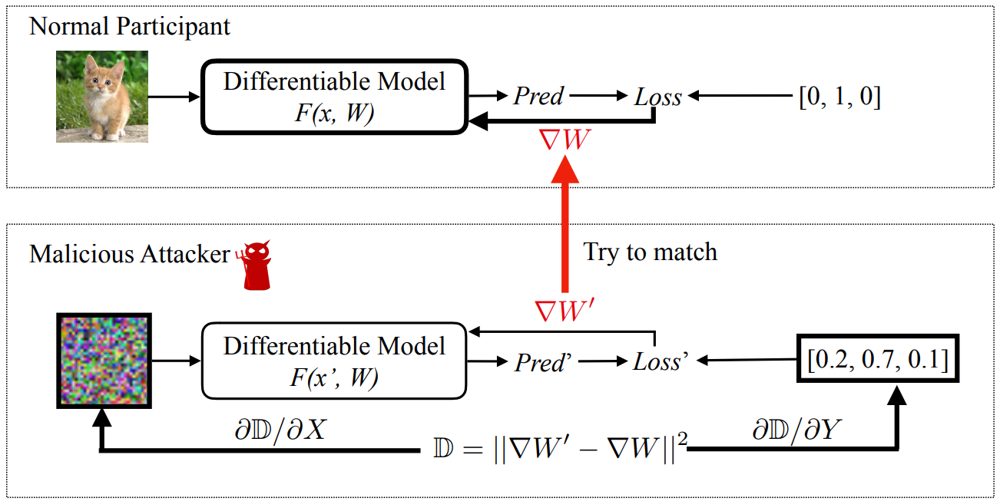

***<u>Figure-10: Gradient-based Data Recovery effect in CIFAR-10 Data Set **[[48](#ref-48)]**.</u>***

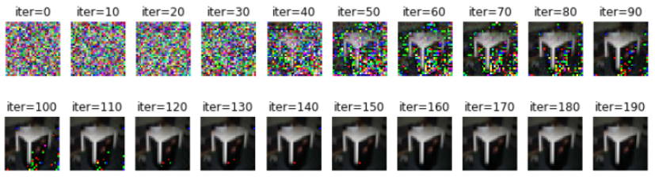

 

### 4.2 Initial Weight Modification

The training of neural network is essentially to solve the optimization problem, and its final result is usually independent of the selection of initial values. However, the latest research shows that using a specific method to initialize the weight of the network can significantly increase the number of iterations, thus increasing the training time **[[49](#ref-49)]**, prolonging the product iteration cycle, and causing huge economic losses. This kind of attack method is very special and hidden, users can hardly detect it.

 

As shown in **[Figure. 11](#figure-11)**, the attacker can initialize the weight of a specific position to a minimum value, so that the eigenvector obtained after several layers of forward propagation is almost zero, which leads to the minimum training gradient calculated in the back-propagation process and makes it difficult for the network to learn. The attacker can implement this attack by modifying the default initialization method.

 

**<u>Defense suggestions:</u>** Check the initialization mechanism of weights.

 

***<u>Figure-11: Hazard mechanism of weight modification **[[49](#ref-49)]**.</u>***

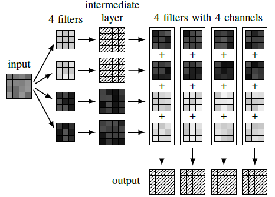

 

### 4.3 Code Attack

In the training phase of the network, the attacker can mislead the training process by controlling the developer's machine for code attack. Code attack mainly uses methods like malicious tampering with configuration information, hijacking compilation process, and log error inducement, to make the actual code executed or called by users inconsistent with the preset code. This kind of attack makes the key parameters or logic in the training process manipulated by the attacker, which seriously affects the result of network training and brings great obstacles to the product development process. Specifically, malicious tampering with the configuration information refers to manipulating the storage area corresponding to the parameters from the memory when reading the configuration file, and then modifying the parameter configuration, thus affecting the final training model. Specifically, when training large-scale neural networks, users will load training configuration information such as example, hyper parameter, data model address from a specific file (such as.py, .json, etc.). By changing these parameters, attackers can have a significant impact on the final training effect of the network. In addition, because the training of neural networks is generally a "black box problem", researchers tend to attribute the bad results to the design of the network, and will not be aware of the impact of such attacks.

 

Hijacking compilation process means that, in addition to directly tampering with the super parameters, through code injection, the attacker Hook the ReadFile class function of the program during the compilation process, replaces the original code to result in the generation of machine code with the specified function of the attacker. In this way, the actual code logic, network structure and even training data of the training program will deviate from the user's preset, which will have a great impact on the results. Similarly, it is also difficult for AI researchers to trace such security risks.
Network trainers often use Tensorboard to monitor the training process of the model. Log error induction refers to that an attacker exploits the vulnerability in Tensorboard visualization or MITM man-hijacking attack to invade and tamper with the data information in the protocol transmission, making the network training curve on the monitor inconsistent with the reality. According to the wrong experimental results, researchers will make wrong decisions, which will mislead the follow-up research direction and bring great obstacles to the product development process.

 

**<u>Defense suggestions:</u>** Strengthen the security protection measures for the network security infrastructure, update the software patch version in time, and strengthen the security inspection of the third-party library and model file.

 

### 4.4 Training Backdoor Attack

Training a good deep learning model often requires a lot of computing resources. Therefore, many users choose to use the third-party platform for model training. This kind of uncontrollable training process also has the risk of being attacked by the back door. Specifically, since the training process is invisible to the users, the (malicious) third-party training platform can modify the training data set submitted by users during the training process, and implant the backdoor in the way similar to the data backdoor attack described in [Section 3.2](#Data-Backdoor-Attack) of this report.

 

**<u>Defense suggestions:</u>** Avoid using the risk of third-party computing platform for training; after obtaining the trained model, use the back door defense method described in [Section 3.2](#Data-Backdoor-Attack) of this report to check and eliminate the back door.

 

### 4.5 Non-centralized Scenarios
Federated learning is a distributed learning paradigm proposed to break the data island and realize AI cooperation in non-centralized scenarios. Participants can train the model locally without disclosing their own data and jointly maintain a global model. However, the distributed feature of Federated learning makes it the most likely model to be attacked by data poisoning. Attackers can control multiple participants to poison data locally to achieve the impact on the global model.

 

In terms of attack purposes, attacks against federated learning can be divided into the following three types: (1) data poisoning attack can greatly reduce the accuracy of the model **[[27](#ref-27),[52](#ref-52)]**; (2) Byzantine attack can make joint model unable to converge **[[27](#ref-27)]**; (3) backdoor attack **[[51](#ref-51),[52](#ref-52)]** can lead to malicious control of the model. The first two attacks will cause the waste of model training resources, while the backdoor attack may make the prediction results of the model manipulated by the attacker in a specific scenario, thus causing security risks.

 

***<u>Figure-12: Left: poisoning mechanism for federal learning; Right: Byzantine attack principle **[[50](#ref-50)]**.</u>***

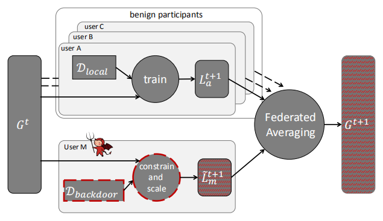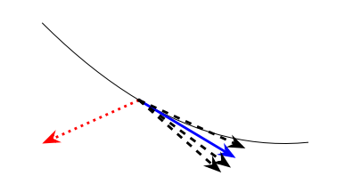

 

Specifically, as shown in **[Figure. 12](#figure-12)**, attackers can manipulate one or more participants to train with poison data locally, and then affect the gradient mean value of server node aggregation to realize backdoor attack **[[27](#ref-27)]**. In addition, if the training results of the model submitted by participants are completely arbitrary and unconstrained, Byzantine attacks may also occur, resulting in the failure in model convergence **[[27](#ref-27)]**. As shown in **[Figure. 12](#figure-12)**, the gradient estimates calculated by the normal participants (black dotted arrow) are distributed around the actual gradient (Blue Solid arrow) of the cost function. Malicious participants can give a vector far away from the normal gradient (red dotted arrow), thus affecting the convergence of the model **[[50](#ref-50)]**.

 

**<u>Defense suggestions for poisoning attack:</u>** Set the update norm threshold of the model and ignore the updates that exceed the threshold, limit the update ability of each participant by using standardized tailoring, and add a small amount of noise to the updated value of the model by (weak) differential privacy method **[[51](#ref-51)]**.

 

**<u>Defense suggestion for Byzantine attack:</u>** Using Krum algorithm to alleviate Byzantine attack by excluding "far" vectors **[[50](#ref-50)]**. Since this method introduces additional detection module, the convergence speed will be reduced compared with normal training.

 

## 5. Model Deployment

### 5.1 Data Recovery in the Model

At present, many enterprises protect data security by only opening the model and hiding the training data. However, the latest research shows that it is still possible for attackers to recover the original training data by using the model. Specifically, the batch normalization layer contained in most networks takes the information of the training set image in the feature diagram. WIth this information, the attacker can restore the training data to the maximum extent **[[53](#ref-53)]**. The schematic diagram is shown in **[Figure. 13](#figure-13)**.

 

The research of this kind of attack and defense is still in its infancy, and there is no mature attack and defense means.

 

***<u>Figure-13: Model-based data recovery mechanism **[[53](#ref-53)]**.</u>***

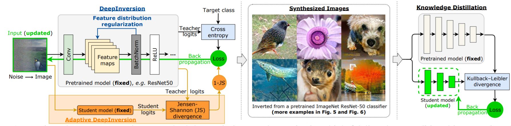

 

### 5.2 Model File Attack

The existing attacks on models are mostly achieved by modifying the data level. In fact, there are some attacks during the deployment phase by manipulating memory or modifying model files directly.  For example, the model files saved by various machine learning frameworks are serialized and stored on disk in a specific format, and the model hierarchy, data parameters, and other information can be obtained through reverse analysis. The attacker can modify a specific number of bits of data in the model to realize the backdoor function or disabled the model function. Compared with data poisoning, the link of direct manipulation model is shorter and faster, but it also requires the attacker to have higher control authority on the attacked model.

 

Deep learning frameworks such as Pytorch mostly use pickling serialization to store model structures and parameters. Attackers can embed malicious code when the model is saved and execute malicious commands automatically when the model is deserialized. In addition, the attacker can also modify the weight of specific neurons in the model file to crash the model performance **[[12](#ref-12)]** or insert the backdoor function. As shown in **[Figure. 14](#figure-14)**, based on the method in **[[11](#ref-11)]**, attackers can reduce the model accuracy from 70% to 0.1% by flipping 13 bits in 93M bit parameters. The attacker can even hide the malicious binary code content inside the model parameters and execute it at a specific time.

 

The research of this kind of attack is also in the early stage. The research on direct tampering model is seldom discussed in academic circles, but it is directly effective in actual scenes. In the algorithm, there is still a lot of room for discussion on how to accurately locate the modified key neuron information in the model.

 

***<u>Figure-14: Bit flip attack mechanism **[[11](#ref-11)]**.</u>***

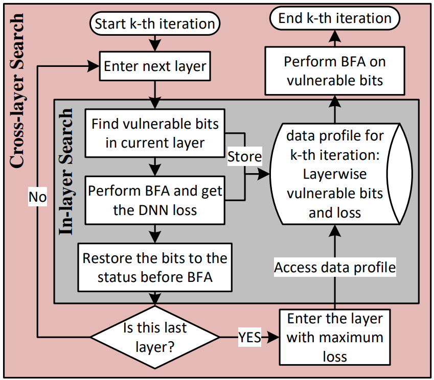

 

## 6. Model Usage

 

 

### 6.1 Digital Adversarial Attacks

Adversarial attack is a kind of attack mode aimed at the call link of AI model [56, 57, 58, 59, 60]. By adding malicious noise (also known as attack noise) to the normal samples, which is hard to detect by human eyes, the attacker makes the AI model generate a wrong prediction to the samples (i.e. adversarial samples). Taking the classification model as an example, as shown in **[Figure. 15](#figure-15)**, Inception model [54] can accurately predict the clean sample x as "Afghan Hound", but after adding a small amount of anti noise $\epsilon$, the adversarial sample $x+\epsilon$ is wrongly predicted as "compound toe monkey" by the concept. Although the AI model represented by deep neural network has been widely used in many fields such as finance, security, automatic driving and so on, the adversarial attack reveals that the AI model itself still has great security risks.

***<u>Figure-15</u>***

**Figure 15**: For the Inception model [54], an example of a test adversarial attack on image classification, the clean image comes from Imagenet.

There are usually two goals for adversarial attacks to achieve: 1) the noise amplitude is so small that it is difficult to be detected by human eyes; 2) the prediction of confrontation samples is inconsistent with normal ones. According to these two characteristics, the method of generating countermeasure samples can be modeled as the following optimization problems:

Where $x$ is the normal sample, and its correct label is $y$ , $x_\epsilon$ is its corresponding adversarial sample,  $t$ is the target category of counter attack; $f(\cdot;w)$ is the deep learning model to attack, where $w$ is the model parameter; $C$ is some specific constraints $x_\epsilon$ needs to satisfy, and the value range is $[0,1]$. $D$ is the distance function, which is used to measure the difference between $x_\epsilon$ and $x$. The loss function $L_1$ is used to measure the difference between the output of the adversarial sample  $f(\cdot;w)$ and the attack target $t$. In view of the different factors in the above objective function, it can adopt a variety of settings, which develops a variety of adversarial attack, such as white-box attack, black box attack, target attack, non-target attack, etc. **[Figure. 16](#figure-16)** shows the current common types of adversarial attack.

***<u>Figure-16</u>***

<b>Figure 16</b>: General expressions and common types of adversarial attacks

White box attack means that the attacker has the knowledge about the structure and weights of the target model $f(\cdot;w)$. In white box attack, the attacker could directly optimize the target function (1) by gradient descent method to obtain the attack sample $x_\epsilon$. But in a real attack scenarios, the structure and weight of the attacked model are usually invisible to the attacker. Black box attack studies how to solve the attack sample  $x_\epsilon$ when the structure and weight of the attacked model cannot be obtained. Due to the structure and parameters of target model $f(\cdot;w)$ are known, the objective function (1) can not be directly derived from the attack noise $x_\epsilon$. However, attackers can usually obtain the prediction output of the model  $f(\cdot;w)$ through API calls such as obtaining the similarity of face comparison through API calls. Attackers access the model through API calls and modify the corresponding input samples according to the returning results to achieve the purpose of attack. One of the most important evaluation standard of black-box attack is the number of API calls required to attack successfully. Up to now, the main methods of black-box attack include migration attacks, gradient estimation, random search, etc. [62, 63, 64, 65, 66, 67, 68, 69, 70, 71]. Among these attacks, migration attacks obtain attack samples by constructing alternative models and performing white-box attacks on the alternative models, and then use the attack samples to directly attack the black-box model [69]. Besides, the methods based on migration attack can achieve a certain outcome on non-target attack, but do not perform well on target attack. As for gradient estimation, it refers to estimating the gradient of the black-box model $f(\cdot;w)$ with respect to $x_\epsilon$ and using the gradient descent method to find out the attack samples [62,72]. Such as zero-order optimization algorithm, the core of gradient estimation is how to efficiently estimate the gradient of the black box model. For random search, it is also a black box attack method which has been widely studied in recent. Random search usually combines some prior knowledge to improve the search efficiency. For instance, the prior knowledge could be a successful attack noise usually occurs on the boundary of feasible region. At present, it has successfully solved many tasks such as image classification [62,71], face recognition [63], video detection [64] by means of black box attack. For example, for CIFAR-10 [74] image classification task, an average of 44 API calls can realize non-target attack for Densenet classification model, and an average of 787 API calls for target attack [71].

In the process of black-box attack, the training data, model structure, model parameters, and other information of the target model are not needed, and the attack is only realized through API calls. The black-box attack is more consistent with the real application scenario. However, successful black box attacks usually require a large amount of API calls, especially for complex AI models. For instance, the face comparison model, usually takes thousands of API calls to generate invisible adversarial noise by black-box attack. This large number of API calls can be easily defended by the target model. The The research hotspot of black box attacks is how to combine prior knowledge to reduce the amount of API calls needed for successful attack. If the number of API calls is reduced from thousands of times to less than 100 times, there will be great security risks to the real AI system.

At present, adversarial attacks are mainly concentrated in the field of computer vision[75], but there are also some adversarial attacks attempt on speech system [76,77,78,79,80]. As shown in **[Figure. 17](#figure-17)**, the attacker adds tiny noises that cannot be felt by human ears to normal speech fragments, so that the speech recognition system recognizes them as completely different content [61].

***<u>Figure-17</u>***

<b>Figure 17</b>: Targeted attack on audio text conversion[61]

Speech recognition system has been widely used in smart home devices, such as smart radio and so on. The attacker may implant adversarial disturbance module in the smart home device to make the user's instructions be misidentified as other instructions, which will bring great security risks. Similarly, audio attack can also be divided into target attack and non-target attack. The former requires that the adversarial audio is recognized as specific content, while the latter only requires that the adversarial audio is mistakenly recognized as others' audio. Because of the sound spectrum complexity, it is more difficult to achieve target attack. In addition, the model and preprocessing operation of voice system are often complex, which also brings great difficulties to attackers. At present, audio attacks mainly focus on white-box attack stage. How to embed the generation process of countermeasure audio into the cascade module of the device, and how to generate the real-time countermeasure audio are potential research directions.

Except visual and audio attacks, AI systems based on text[81], recommendation system[82], reinforcement learning[83], retrieval[58] and other technologies may also be attacked by adversarial samples.

**<u>Tips for defense:</u>** faced with the threat of confrontational attacks, feasible defense suggestions include:

- Analyze the factors that affect the robustness of the model from the model structure level, and design a more robust model structure.
- Analyze the robust and non robust features contained in the training data from the data level, and try to fit the robust features during training.
- Analyze the reason of confrontation samples from the training mechanism, and get a more robust model through confrontation training [56].
- In the model deployment phase, steps such as confrontation detection, image preprocessing (coding, compression, affine transformation, etc.) are added to resist the attack.
- Limit API access frequency to prevent black box attacks based on API calls.

 

 

### 6.2 **Physical Counter Attack**

At present, most of the counter attacks occur in the digital space, that is, directly tamper with the objects stored in the digital space (such as stored image pixel value, etc.) to achieve the purpose of attack. However, in real application scenarios, applications usually scan the objects in the physical world through sensors (such as cameras) to obtain the corresponding expression in the digital space, and then discriminate the objects in the digital space. The face recognition system can capture face images in real time through cameras and recognize them. The autopilot can obtain the state of the surrounding objects through multiple sensors. In this case, since the process of scanning and imaging is not accessible to the attacker, the attacker usually does not have the right to directly fight against tampering with the objects in the scanned digital space. Physical attack studies, how to directly change the object in the physical world, to achieve the effect of anti attack.

***<u>Figure-18</u>***

<b>Figure 18</b>: Traffic sign sticker attack, image from literature [84]

At present, the typical physical attack method is to put a special attack sticker on the real object to achieve the purpose of attack [84,85,86,87,88,89,90,91,92]. Physical attacks against object recognition systems are studied in [84]. As shown in **[Figure. 18](#figure-18)**, by putting a specific black and white attack sticker on the stop sign, the classifier can wrongly identify the stops sign as a speed limit sign, which poses a great security risk to the automatic driving system. Reference [85] studied the physical attack against the face recognition system. By generating special eyeglass frame stickers to deceive the face recognition system, it brought great security risks to face security, face payment and other systems.

Since it is impossible to model and optimize noise iteratively in physical space, physical attacks are usually accomplished by migration learning. That is to say, firstly, the surrogate model is constructed and the attack noise is generated in the digital space. Secondly, the attack noise is printed and pasted on the specific object for physical space attack. Therefore, physical attack involves the conversion process from digital space to physical space. Due to the problem of printer accuracy, there are usually some color distortion in the process of image printing in digital space, and there are different physical environments in the process of camera capture and re acquisition, The variation of lighting conditions, shooting angle and shooting distance makes the difference between the anti noise in digital space and that after printing and re acquisition, which leads to the successful attack of anti noise in digital space. When the anti noise acts on the physical space, the attack effect is usually limited. The key point of physical attack is to explore how to improve the robustness of anti noise to physical environment changes. At present, the commonly used physical attack methods usually consider the printer non printability score (NPS) [85] constraint and fusion of different expectation over transformation (EOT) [86]. NPS calculates a set of pixels range set S that the printer can print in advance, and then constrains the attack noise as much as possible in the process of solving the attack noise.

***<u>Figure-19</u>***

<b>Figure 19</b>: Schematic diagram of model stealing

In order to reduce the precision loss caused by the printer. EOT considers the possible transformations in physical space (such as rotation transformation, distance transformation, angle transformation, etc.), and then solves the anti noise problem in digital space, which makes the anti noise robust to these changes.

**<u>Tips for defense:</u>** The defense against physical attacks can start from several aspects such as data acquisition, noise detection, and adversarial-robust models. Up to now, physical attack is not very effective in modeling the real environment changes. In the data acquisition stage, we can collect more pictures from different angles and the environment for joint judgment to prevent physical attacks. The target of noise detection is to detect the input image before sending it into the model to judge whether the input image has been tampered with or not The principle is to make use of the difference in data distribution between anti noise image and clean image; the purpose of anti robust model is to make the model itself robust to attack noise, which can be realized by confrontation training.

  

### 6.3 **Model Stealing**

With the deepening of deep learning network, the training cost is also increasing. Good performance models have become an important core property of companies/research institutions. In order to protect the model and open the functions to the public, relevant organizations often deploy the model in the cloud and open the API to users to realize "machine learning as a service" (MLaaS). However, recent studies show that attackers can query the output of the network by calling the API many times, and then steal the function of the model. The specific principle is shown in **[Figure. 19](#figure-19)**.

[94] is the first time to propose the model of stealing through API, which opens up the research work of this attack direction. However, [94] can steal a smaller model. In order to alleviate this problem, [95] proposed a method that can steal a slightly larger model. In addition, [93] explored the conditions and factors of model stealing in detail, and realized large-scale network stealing with reinforcement learning. [96] using adversarial attack, the number of queries needed to steal is significantly reduced, and the models of famous platforms are successfully stolen with low cost.

**<u>Tips for defense:</u>** Limit the number of user queries, only output results, and hide the output details of the model.

***<u>Figure-20</u>***

<b>Figure 20</b>: Memory space diagram of neural network runtime [97]. Attackers can read and write arbitrary address through memory overflow vulnerability, and then attack the model by modifying the model parameters.

  

### 6.4 **GPU/CPU overflow destruction**

At present, most of the attacks against AI systems are based on data and algorithms, and there are also some security problems in memory. Attackers can construct precise memory overflows for specific GPUs. For example, CUDA memory model supported by NVIDIA graphics card can cover some neuron information in neural network through memory overflow, which makes the prediction of network model deviate. The GitHub project [97] mentions such an attack mode. Specifically, a typical computer vision application will input all images into neural network for preprocessing before classification. In order to speed up the processing, researchers will load images and models into DRAM. Because the preprocessing process needs to be able to modify the image and the model is generally large, which will lead to both using global memory, resulting in the memory model structure in **[Figure. 20](#figure-20)**.

Obviously, an attacker can override the network model if he can overflow the memory allocated to the image. Once the parameters of the covered model can be accurately controlled, then the neural network can be transformed into an invalid network or even a backdoor network by attackers, causing a serious threat.

However, the research in this field is still in a very early stage, and there is no mature defense method.

  

  

## 7. **Model Architecture**

  

### **7.1  Query Architecture Stealing**

The similarity of model architecture is an important factor to determine the mobility of adversarial attack. If the attacker can obtain the structure information of the attacked model, it will greatly increase the success rate of subsequent attacks.

Although the current research on architecture theft has just begun, some related research results have been produced. For example, an attacker can guess the network structure with ReLu activation function by querying the network output. This risk of attack is due to the nature of the ReLu network. Specifically, ReLu is piecewise linear, and the boundaries of different segments correspond to the input values that make ReLu switch between active and dormant status. Therefore, the attacker can determine the structure of the network layer by layer. As shown in **[Figure. 21](#figure-21)**, the experimental results in the right figure show that using the principle shown in the left figure, the attacker can accurately estimate the number of neurons in a certain layer of the network through this method.

Recently, the research in this field is still in a very early stage, and there is no mature defense method.

***<u>Figure-21</u>***

<b>Figure 21</b>: Query architecture theft [101]

***<u>Figure-22</u>***

<b>Figure 22</b>: Side channel architecture theft result [102]

  

### **7.2  Side Channel Architecture Stealing**

Side channel attack refers to the attack that uses power, time consumption or electromagnetic radiation to obtain information, rather than through brute force or theoretical weakness in the algorithm. [102] using the idea of side channel attack. As long as the attacker and the victim are on the same host and use the same deep learning framework, the attacker can recover the execution order of specific commands in one reasoning of the model by monitoring the cache, and then deduce the network structure or super parameters. This kind of attack can achieve high accuracy, as shown in **[Figure. 22](#figure-22)**.

Attackers can steal the structure information of the model through the side channel architecture, and then train the reconstructed architecture on the data set to steal the function of the target model, which seriously infringes the privacy and intellectual property rights of professional algorithms deployed by enterprises, and causes serious business losses for enterprises.

At present, the research in this field is still in the very early stage, and there is no mature defense method.

    

## **8. Effect of Results**

  

### **8.1 Model Misjudgment**

The most direct impact of AI attack is to make the model generate wrong predictions. The ultimate goal of counter attack, poison attack and backdoor attack is to mislead the model through directional or non directional ways. 

***<u>Figure-23</u>***

<b>Figure 23</b>: Schematic diagram of the misjudgment result of the target detection network [103]

In the non-directional attack, the attacker wants to confuse the judgment of the network, reduce the confidence score of the decision, and even make a wrong decision. For example, in the face recognition scene, the attacker can make a pair of originally similar faces fail to match [104]; in the target detection, the attacker can make the object not be detected [105], or be recognized as another object; in the recommendation system, the attacker can make the system give a completely unrelated recommendation [106].

At present, for the depth system of different tasks, it is easy to find the confrontation samples [107,108,109,92] with inconsistent judgment of human and system, so as to realize the non-directional attack. These counter samples are almost the same as the original samples, but they can make the output of the network change dramatically. The existence of adversarial samples causes great trouble and security risk to the users of the system. In addition, these attacks have certain migration ability. In the example in **[Figure. 23](#figure-23)**, the adversarial samples generated by the Mask R-CNN model can also migrate to attack the other five models. As a result, the model can not recognize the computer, keyboard and other objects in the picture, and it will give the wrong prediction result "bed".

The undirected attack only requires the model to make a wrong judgment on the sample, while the directed attack further requires the model to make a specific wrong judgment. As shown in **[Figure. 24](#figure-24)**, the five pre trained models on Imagenet can correctly predict the clean samples. However, the attacker can make three networks output the specified error result "bonnet" [110] by imposing a small disturbance on the image. In face recognition, the attacker can generate counter disturbance in a similar way, which makes the model judge the visitor to be an administrator with high authority, resulting in serious security crisis. At present, the more harmful black-box directed attack is also widely studied.

***<u>Figure-24</u>***

<b>Figure 24</b>: Directed confrontation attack [110]

  

### **8.2  Information Leakage**

If model misjudgment is an attack on AI system, then information disclosure is stealing the AI system. This kind of attack can lead to the function of the model being restored by a third party, resulting in the leakage of user privacy and the theft of company information assets.

A good model is often supported by a lot of computational power in training and high-quality data. In many scenarios, enterprises deploy well-trained models in the cloud and open API interfaces for users. Users can get a large number of model outputs according to a large number of input queries, so as to model the system, reverse restore its functions, then reduce the competitiveness of commercial models, and reduce its revenue.

In the medical or financial field, user data is extremely important resource. If leaked, it will cause serious privacy crisis and loss of business value. Because machine learning is data-driven, researchers usually use distributed methods to break data islands, unite data between enterprises, and ensure data security. However, in this scenario, it is still possible for the trainer to steal the content of the data terminal. In addition, if the project results are delivered in the form of model, the attacker may also recover the training data based on the model, which will cause privacy crisis.

 

## 9. Conclusion

At present, AI technology has been widely used in face payment, face security, speech recognition, machine translation and many other scenarios. The security of AI system has also attracted more and more attention in the industry. Malicious attacks against AI models can bring huge security risks to users. For example, an attacker could use a specially designed attack sticker to trick a facial recognition system, resulting in loss of life and property. Aiming at the security problems of AI model, this report, from the perspective of an attacker, summarizes the possible security risks in all aspects of the entire life cycle of AI model, and gives corresponding defense suggestions. This report not only includes common attacks such as software attack, Docker malicious access attack and supply chain attack, but also includes new attack methods such as counter attack and backdoor attack against AI model. It is helpful for AI development and technical operation personnel to understand the risk points and defense methods of AI system under the whole life cycle, and provide necessary technical support for the security deployment and application landing of AI system.

 

## 10. Copyright and Risk Statement

The copyright of this report belongs to Tencent. The report is only for reference of general suggestions. Readers should not take any action according to any information in the report without specific professional suggestions. Tencent will not be responsible for any loss caused by using the information in this report.

 

### 10.1 Author's Unit

**<u>Tencent AI Lab</u>**
Baoyuan Wu (baoyuanwu@tencent.com) 
Yanbo Fan (yanbofan@tencent.com) 
Yong Zhang (norriszhang@tencent.com) 
Yiming Li (georgli@tencent.com) 
Zhifeng Li (michaelzfli@tencent.com) 
Wei Liu (vincentwliu@tencent.com)

 

**<u>Zhuque Laboratory of Tencent Security Platform Department</u>**
vikingli (vikingli@tencent.com) 
jifengzhu (jifengzhu@tencent.com) 
allenszchen (allenszchen@tencent.com) 
ucasjhxu (ucasjhxu@tencent.com) 
dylandi (dylandi@tencent.com) 
xunsu (xunsu@tencent.com)

### 10.1 About Us

**<u>Tencent AI Lab</u>**
Tencent AI Lab is Tencent's enterprise AI Lab, which was established in Shenzhen in April 2016. With the help of Tencent's long-term accumulation of rich application scenarios, big data, computing power and first-class talents, AI Lab is based on the future, open and cooperative, and is committed to continuously improving AI's understanding, decision-making and creativity, moving towards the vision of "make AI everywhere".

 

***<u>Figure-25: Tencent AI lab

 

**<u>Zhuque Laboratory of Tencent Security Platform Department</u>**
Zhuque Laboratory of Tencent security platform department focuses on the research of combat level comprehensive attack and AI security technology, in order to promote attack and defense, pre-research the potential risks of cutting-edge technology and the company's business, and protect Tencent's business and user security.

 

***<u>Figure-26: Zhuque Laboratory of Tencent Security Platform Department

 

## Reference

[1] Q. Xiao, K. Li, D. Zhang, and W. Xu, “Security risks in deep learning implementa-tions,” in IEEE S&P Workshop, 2018.

[2] https://www.cvedetails.com/vulnerability-list/vendor_id-1224/product_id-53738/Google-Tensorflow.html.

[3] https://www.securityweek.com/serious-vulnerabilities-patched-opencv-computer-vision-library.

[4] https://www.secpod.com/blog/opencv-buffer-overflow-vulnerabilities-jan-2020/.

[5] https://www.microsoft.com/security/blog/2020/06/10/misconfigured-kubeflow-workloads-are-a-security-risk.

[6] https://security.tencent.com/index.php/blog/msg/130.

[7] https://www.kubeflow.org/docs/notebooks/setup/.

[8] https://www.microsoft.com/security/blog/2020/04/02/attack-matrix-kubernetes/.

[9] J. Clements and Y. Lao, “Hardware trojan attacks on neural networks”, arXiv preprintarXiv:1806.05768, 2018.

[10] A. S. Rakin, Z. He, and D. Fan, “Bit-flip attack: Crushing neural network with pro-gressive bit search,” in ICCV, 2019.

[11] Z. Liu, J. Ye, X. Hu, H. Li, X. Li, and Y. Hu, “Sequence triggered hardware trojan inneural network accelerator,” in VTS, 2020

[12] nEINEI, ““黑”掉神经网络：通过逆向模型文件来重构模型后门,” in XFocus Infor-mation Security Conference, 2020.

[13] C. Zhu, W. R. Huang, A. Shafahi, H. Li, G. Taylor, C. Studer, and T. Gold-stein, “Transferable clean-label poisoning attacks on deep neural nets,” arXiv preprintarXiv:1905.05897, 2019.

[14] A. Shafahi, W. R. Huang, M. Najibi, O. Suciu, C. Studer, T. Dumitras, and T. Gold-stein, “Poison frogs! targeted clean-label poisoning attacks on neural networks,” in NeurIPS, 2018.

[15] H. Xiao, B. Biggio, B. Nelson, H. Xiao, C. Eckert, and F. Roli, “Support vectormachines under adversarial label contamination,” Neurocomputing, vol. 160, pp. 53–62, 2015.

[16] B. Biggio, B. Nelson, and P. Laskov, “Poisoning attacks against support vector ma-chines,”arXiv preprint arXiv:1206.6389, 2012.

[17] S. Mei and X. Zhu, “Using machine teaching to identify optimal training-set attackson machine learners.” in AAAI, 2015.

[18] J. Feng, Q.-Z. Cai, and Z.-H. Zhou, “Learning to confuse: Generating training timeadversarial data with auto-encoder,” in NeurIPS, 2019.

[19] H. Chacon, S. Silva, and P. Rad, “Deep learning poison data attack detection,” in ICTAI, 2019.

[20] Y. Chen, Y. Mao, H. Liang, S. Yu, Y. Wei, and S. Leng, “Data poison detectionschemes for distributed machine learning,” IEEE Access, vol. 8, pp. 7442–7454, 2019.

[21] Y. Li, B. Wu, Y. Jiang, Z. Li, and S.-T. Xia, “Backdoor learning: A survey,” arXivpreprint arXiv:2007.08745, 2020.

[22] T. Gu, K. Liu, B. Dolan-Gavitt, and S. Garg, “Badnets: Evaluating backdooringattacks on deep neural networks,”IEEE Access, vol. 7, pp. 47230–47244, 2019.

[23] A. Saha, A. Subramanya, and H. Pirsiavash, “Hidden trigger backdoor attacks,” in AAAI, 2020.

[24] S. Zhao, X. Ma, X. Zheng, J. Bailey, J. Chen, and Y.-G. Jiang, “Clean-label backdoorattacks on video recognition models,” in CVPR, 2020.

[25] X. Chen, C. Liu, B. Li, K. Lu, and D. Song, “Targeted backdoor attacks on deeplearning systems using data poisoning,” arXiv preprint arXiv:1712.05526, 2017.

[26] J. Dai, C. Chen, and Y. Li, “A backdoor attack against lstm-based text classificationsystems,” IEEE Access, vol. 7, pp. 138872–138878, 2019.

[27] E. Bagdasaryan, A. Veit, Y. Hua, D. Estrin, and V. Shmatikov, “How to backdoorfederated learning,” in AISTATS, 2020.

[28] K. Kurita, P. Michel, and G. Neubig, “Weight poisoning attacks on pre-trained mod-els,” in ACL, 2020.

[29] B. Wang, X. Cao, N. Z. Gong,et al., “On certifying robustness against backdoorattacks via randomized smoothing,” in CVPR Workshop, 2020.

[30] M. Weber, X. Xu, B. Karlas, C. Zhang, and B. Li, “Rab: Provable robustness againstbackdoor attacks,”arXiv preprint arXiv:2003.08904, 2020.

[31] Y. Liu, Y. Xie, and A. Srivastava, “Neural trojans,” in ICCD, 2017.

[32] B. G. Doan, E. Abbasnejad, and D. C. Ranasinghe, “Februus: Input purificationdefense against trojan attacks on deep neural network systems,” in arXiv: 1908.03369,2019.

[33] Y. Li, T. Zhai, B. Wu, Y. Jiang, Z. Li, and S. Xia, “Rethinking the trigger of backdoorattack,”arXiv preprint arXiv:2004.04692, 2020.

[34] K. Liu, B. Dolan-Gavitt, and S. Garg, “Fine-pruning: Defending against backdooringattacks on deep neural networks,” in RAID, 2018.

[35] P. Zhao, P.-Y. Chen, P. Das, K. N. Ramamurthy, and X. Lin, “Bridging mode con-nectivity in loss landscapes and adversarial robustness,” in ICLR, 2020.

[36] B. Wang, Y. Yao, S. Shan, H. Li, B. Viswanath, H. Zheng, and B. Y. Zhao, “Neuralcleanse: Identifying and mitigating backdoor attacks in neural networks,” in IEEES&P, 2019.

[37] X. Qiao, Y. Yang, and H. Li, “Defending neural backdoors via generative distributionmodeling,” in NeurIPS, 2019.

[38] H. Chen, C. Fu, J. Zhao, and F. Koushanfar, “Deepinspect: A black-box trojan detec-tion and mitigation framework for deep neural networks.” in IJCAI, 2019.

[39] S. Kolouri, A. Saha, H. Pirsiavash, and H. Hoffmann, “Universal litmus patterns:Revealing backdoor attacks in cnns,” in CVPR, 2020.

[40] S. Huang, W. Peng, Z. Jia, and Z. Tu, “One-pixel signature: Characterizing cnn modelsfor backdoor detection,” in ECCV, 2020.

[41] R. Wang, G. Zhang, S. Liu, P.-Y. Chen, J. Xiong, and M. Wang, “Practical detectionof trojan neural networks: Data-limited and data-free cases,” in ECCV, 2020.

[42] B. Tran, J. Li, and A. Madry, “Spectral signatures in backdoor attacks,” in NeurIPS,2018.

[43] B. Chen, W. Carvalho, N. Baracaldo, H. Ludwig, B. Edwards, T. Lee, I. Molloy,and B. Srivastava, “Detecting backdoor attacks on deep neural networks by activationclustering,” in AAAI Workshop, 2018.

[44] Y. Gao, C. Xu, D. Wang, S. Chen, D. C. Ranasinghe, and S. Nepal, “Strip: A defenceagainst trojan attacks on deep neural networks,” in ACSAC, 2019.

[45] M. Du, R. Jia, and D. Song, “Robust anomaly detection and backdoor attack detectionvia differential privacy,” in ICLR, 2020.

[46] S. Hong, V. Chandrasekaran, Y. Kaya, T. Dumitraş, and N. Papernot, “On the effec-tiveness of mitigating data poisoning attacks with gradient shaping,”arXiv preprintarXiv:2002.11497, 2020.

[47] S. B. Venkatakrishnan, S. Gupta, H. Mao, M. Alizadeh,et al., “Learning generalizabledevice placement algorithms for distributed machine learning,” in NeurIPS, 2019.

[48] L. Zhu, Z. Liu, and S. Han, “Deep leakage from gradients,” in NeurIPS, 2019.

[49] K. Grosse, T. A. Trost, M. Mosbach, M. Backes, and D. Klakow, “Adversar-ial initialization–when your network performs the way i want,”arXiv preprintarXiv:1902.03020, 2019.

[50] P. Blanchard, R. Guerraoui, J. Stainer,et al., “Machine learning with adversaries:Byzantine tolerant gradient descent,” in NeurIPS, 2017.

[51] Z. Sun, P. Kairouz, A. T. Suresh, and H. B. McMahan, “Can you really backdoorfederated learning?”arXiv preprint arXiv:1911.07963, 2019.

[52] C. Xie, K. Huang, P.-Y. Chen, and B. Li, “Dba: Distributed backdoor attacks againstfederated learning,” in ICLR, 2019.

[53] H. Yin, P. Molchanov, J. M. Alvarez, Z. Li, A. Mallya, D. Hoiem, N. K. Jha, andJ. Kautz, “Dreaming to distill: Data-free knowledge transfer via deepinversion,” in CVPR, 2020.

[54] I. J. Goodfellow, J. Shlens, and C. Szegedy, “Explaining and harnessing adversarialexamples,” STAT, vol. 1050, p. 20, 2015.

[55] Y. Fan, B. Wu, T. Li, Y. Zhang, M. Li, Z. Li, and Y. Yang, “Sparse adversarial attackvia perturbation factorization,” in ECCV, 2020.

[56] J. Bai, B. Chen, Y. Li, D. Wu, W. Guo, S.-t. Xia, and E.-h. Yang, “Targeted attackfor deep hashing based retrieval,” ECCV, 2020.

[57] Y. Xu, B. Wu, F. Shen, Y. Fan, Y. Zhang, H. T. Shen, and W. Liu, “Exact adversarialattack to image captioning via structured output learning with latent variables,” in CVPR, 2019.

[58] X. Chen, X. Yan, F. Zheng, Y. Jiang, S.-T. Xia, Y. Zhao, and R. Ji, “One-shotadversarial attacks on visual tracking with dual attention,” in CVPR, 2020.

[59] C. Szegedy, V. Vanhoucke, S. Ioffe, J. Shlens, and Z. Wojna, “Rethinking the inceptionarchitecture for computer vision,” in CVPR, 2016.

[60] J. Deng, W. Dong, R. Socher, L.-J. Li, K. Li, and L. Fei-Fei, “Imagenet: A large-scalehierarchical image database,” in CVPR, 2009.

[61] Y. Guo, Z. Yan, and C. Zhang, “Subspace attack: Exploiting promising subspaces forquery-efficient black-box attacks,” in NeurIPS, 2019.

[62] Y. Dong, H. Su, B. Wu, Z. Li, W. Liu, T. Zhang, and J. Zhu, “Efficient decision-basedblack-box adversarial attacks on face recognition,” in CVPR, 2019.

[63] Z. Wei, J. Chen, X. Wei, L. Jiang, T.-S. Chua, F. Zhou, and Y.-G. Jiang, “Heuristicblack-box adversarial attacks on video recognition models.” in AAAI, 2020.

[64] B. Ru, A. Cobb, A. Blaas, and Y. Gal, “Bayesopt adversarial attack,” in ICLR, 2020.

[65] L. Meunier, J. Atif, and O. Teytaud, “Yet another but more efficient black-box ad-versarial attack: tiling and evolution strategies,”arXiv preprint arXiv:1910.02244,2019.

[66] P. Zhao, S. Liu, P.-Y. Chen, N. Hoang, K. Xu, B. Kailkhura, and X. Lin, “On thedesign of black-box adversarial examples by leveraging gradient-free optimization andoperator splitting method,” in ICCV, 2019.

[67] A. Al-Dujaili and U.-M. O’Reilly, “Sign bits are all you need for black-box attacks,”in ICLR, 2019.

[68] N. Papernot, P. McDaniel, I. Goodfellow, S. Jha, Z. B. Celik, and A. Swami, “Practicalblack-box attacks against machine learning,” in ASIACCS, 2017.

[69] Z. Huang and T. Zhang, “Black-box adversarial attack with transferable model-basedembedding,”arXiv preprint arXiv:1911.07140, 2019.

[70] Y. Feng, B. Wu, Y. Fan, Z. Li, and S. Xia, “Efficient black-box adversarialattack guided by the distribution of adversarial perturbations,” arXiv preprintarXiv:2006.08538, 2020.

[71] P.-Y. Chen, H. Zhang, Y. Sharma, J. Yi, and C.-J. Hsieh, “Zoo: Zeroth order opti-mization based black-box attacks to deep neural networks without training substitutemodels,” in Proceedings of the 10th ACM Workshop on Artificial Intelligence and Se-curity, 2017, pp. 15–26.

[72] M. Andriushchenko, F. Croce, N. Flammarion, and M. Hein, “Square attack: a query-efficient black-box adversarial attack via random search,” ECCV, 2020.

[73] A. Krizhevsky, G. Hinton,et al., “Learning multiple layers of features from tiny im-ages,” 2009.

[74] C. Szegedy, W. Zaremba, I. Sutskever, J. Bruna, D. Erhan, I. J. Goodfellow, andR. Fergus, “Intriguing properties of neural networks,” in ICLR, 2014.

[75] Y. Gong and C. Poellabauer, “Crafting adversarial examples for speech paralinguisticsapplications,”arXiv preprint arXiv:1711.03280, 2017.

[76] C. Kereliuk, B. L. Sturm, and J. Larsen, “Deep learning and music adversaries,”IEEETransactions on Multimedia, vol. 17, no. 11, pp. 2059–2071, 2015.

[77] M. Cisse, Y. Adi, N. Neverova, and J. Keshet, “Houdini: Fooling deep structuredprediction models,”arXiv preprint arXiv:1707.05373, 2017.

[78] N. Carlini, P. Mishra, T. Vaidya, Y. Zhang, M. Sherr, C. Shields, D. Wagner, andW. Zhou, “Hidden voice commands,” in USENIX, 2016.

[79] G. Zhang, C. Yan, X. Ji, T. Zhang, T. Zhang, and W. Xu, “Dolphinattack: Inaudiblevoice commands,” in CCS, 2017.

[80] N. Carlini and D. Wagner, “Audio adversarial examples: Targeted attacks on speech-to-text,” in IEEE S&P Workshop, 2018.

[81] J. Li, S. Ji, T. Du, B. Li, and T. Wang, “Textbugger: Generating adversarial textagainst real-world applications,”arXiv preprint arXiv:1812.05271, 2018.

[82] W. Fan, T. Derr, X. Zhao, Y. Ma, H. Liu, J. Wang, J. Tang, and Q. Li, “Attackingblack-box recommendations via copying cross-domain user profiles,”arXiv preprintarXiv:2005.08147, 2020.

[83] S. Huang, N. Papernot, I. Goodfellow, Y. Duan, and P. Abbeel, “Adversarial attackson neural network policies,”arXiv preprint arXiv:1702.02284, 2017.

[84] K. Eykholt, I. Evtimov, E. Fernandes, B. Li, A. Rahmati, C. Xiao, A. Prakash,T. Kohno, and D. Song, “Robust physical-world attacks on deep learning visual clas-sification,” in CVPR, 2018.

[85] M. Sharif, S. Bhagavatula, L. Bauer, and M. K. Reiter, “Accessorize to a crime: Realand stealthy attacks on state-of-the-art face recognition,” in CCS, 2016.

[86] A. Athalye, L. Engstrom, A. Ilyas, and K. Kwok, “Synthesizing robust adversarialexamples,” in ICML, 2018.

[87] M. Sharif, S. Bhagavatula, L. Bauer, and M. K. Reiter, “A general framework foradversarial examples with objectives,”ACM Transactions on Privacy and Security(TOPS), vol. 22, no. 3, pp. 1–30, 2019.

[88] Y. Zhao, H. Zhu, R. Liang, Q. Shen, S. Zhang, and K. Chen, “Seeing isn’tbelieving:  Practical adversarial attack against object detectors,”arXiv preprintarXiv:1812.10217, 2018.

[89] L. Huang, C. Gao, Y. Zhou, C. Xie, A. L. Yuille, C. Zou, and N. Liu, “Universalphysical camouflage attacks on object detectors,” in CVPR, 2020.

[90] Z. Kong, J. Guo, A. Li, and C. Liu, “Physgan: Generating physical-world-resilientadversarial examples for autonomous driving,” in CVPR, 2020.

[91] R. Duan, X. Ma, Y. Wang, J. Bailey, A. K. Qin, and Y. Yang, “Adversarial camouflage:Hiding physical-world attacks with natural styles,” in CVPR, 2020.

[92] Z. Wang, S. Zheng, M. Song, Q. Wang, A. Rahimpour, and H. Qi, “advpattern:Physical-world attacks on deep person re-identification via adversarially transformable patterns,” in ICCV, 2019.

[93] T. Orekondy, B. Schiele, and M. Fritz, “Knockoff nets: Stealing functionality of black-box models,” in CVPR, 2019.

[94] F. Tramèr, F. Zhang, A. Juels, M. K. Reiter, and T. Ristenpart, “Stealing machinelearning models via prediction apis,” in USENIX, 2016.

[95] M. Juuti, S. Szyller, S. Marchal, and N. Asokan, “Prada: protecting against dnn modelstealing attacks,” in EuroS&P.  IEEE, 2019.

[96] H. Yu, K. Yang, T. Zhang, Y.-Y. Tsai, T.-Y. Ho, and Y. Jin, “Cloudleak: Large-scaledeep learning models stealing through adversarial examples,” in NDSS, 2020.

[97] https://github.com/Kayzaks/HackingNeuralNetworks.

[98] https://github.com/Kayzaks/HackingNeuralNetworks/.

[99] R. Stevens, O. Suciu, A. Ruef, S. Hong, M. Hicks, and T. Dumitraş, “Summon-ing demons: The pursuit of exploitable bugs in machine learning,”arXiv preprintarXiv:1701.04739, 2017.

[100] D. Su, H. Zhang, H. Chen, J. Yi, P.-Y. Chen, and Y. Gao, “Is robustness the costof accuracy?–a comprehensive study on the robustness of 18 deep image classificationmodels,” in ECCV, 2018.

[101] D. Rolnick and K. P. Kording, “Identifying weights and architectures of unknown relunetworks,”arXiv preprint arXiv:1910.00744, 2019.

[102] S. Hong, M. Davinroy, Y. Kaya, S. N. Locke, I. Rackow, K. Kulda, D. Dachman-Soled,and T. Dumitraş, “Security analysis of deep neural networks operating in the presenceof cache side-channel attacks,”arXiv preprint arXiv:1810.03487, 2018.

[103] S. Chen, P. Zhang, C. Sun, J. Cai, and X. Huang, “Generate high-resolution adversarialsamples by identifying effective features,”arXiv preprint arXiv:2001.07631, 2020.

[104] C. Xie, J. Wang, Z. Zhang, Y. Zhou, L. Xie, and A. Yuille, “Adversarial examples forsemantic segmentation and object detection,” in ICCV, 2017.

[105] J. Li, R. Ji, H. Liu, X. Hong, Y. Gao, and Q. Tian, “Universal perturbation attackagainst image retrieval,” in ICCV, 2019.

[106] C. Sun, S. Chen, J. Cai, and X. Huang, “Type i attack for generative models,”arXivpreprint arXiv:2003.01872, 2020. 

[107] S. Tang, X. Huang, M. Chen, C. Sun, and J. Yang, “Adversarial attack type I: Cheatclassifiers by significant changes,”IEEE Transactions on Pattern Analysis and Machine Intelligence, 2019.

[108] Y.-C. Lin, Z.-W. Hong, Y.-H. Liao, M.-L. Shih, M.-Y. Liu, and M. Sun, “Tac-tics of adversarial attack on deep reinforcement learning agents,”arXiv preprintarXiv:1703.06748, 2017.

[109] S. Chen, F. He, X. Huang, and K. Zhang, “Attack on multi-node attention for objectdetection,”arXiv preprint arXiv:2008.06822, 2020.

[110] S. Chen, Z. He, C. Sun, and X. Huang, “Universal adversarial attack on attention andthe resulting dataset damagenet,”arXiv preprint arXiv:2001.06325, 2020.

[111] J. Han, X. Dong, R. Zhang, D. Chen, W. Zhang, N. Yu, P. Luo, and X. Wang, “Once aman: Towards multi-target attack via learning multi-target adversarial network once,” in ICCV, 2019.

[112] J. Sun, T. Chen, G. Giannakis, and Z. Yang, “Communication-efficient distributedlearning via lazily aggregated quantized gradients,” in NeurIPS, 2019.

[113] F. He, X. Huang, K. Lv, and J. Yang, “A communication-efficient distributed algorithmfor kernel principal component analysis,”arXiv preprint arXiv:2005.02664, 2020.

    

**End**
